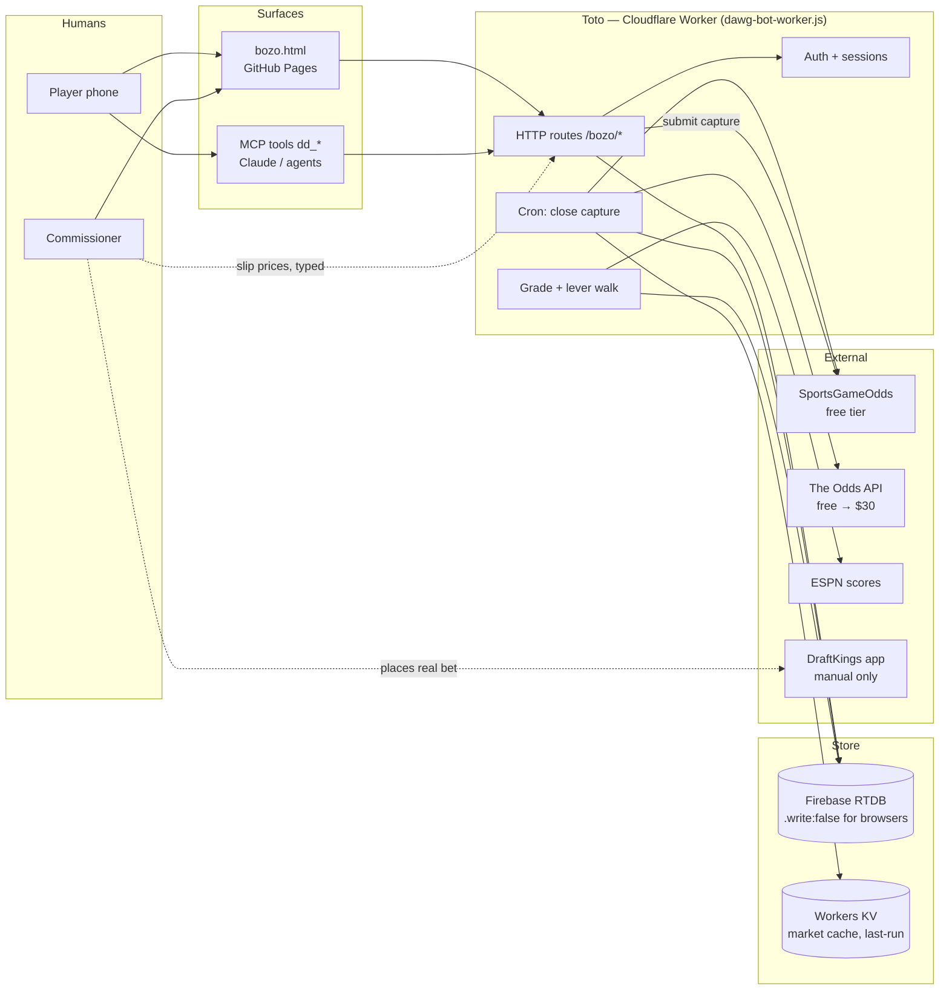
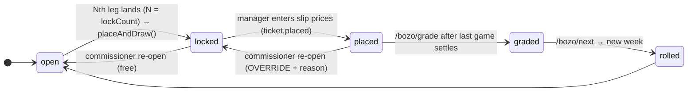
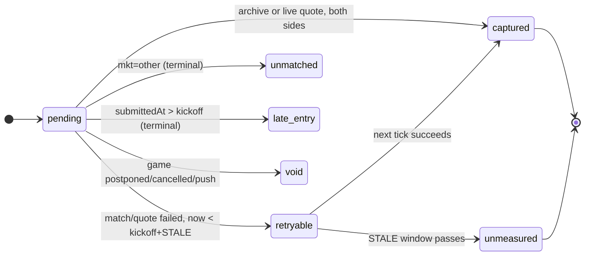
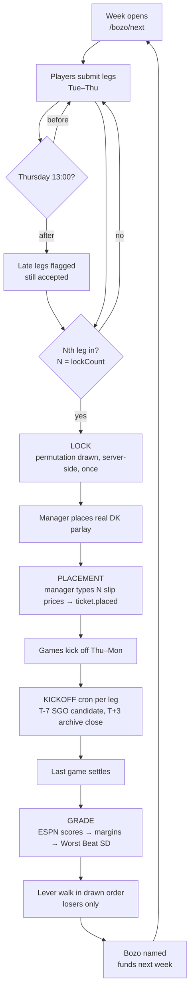
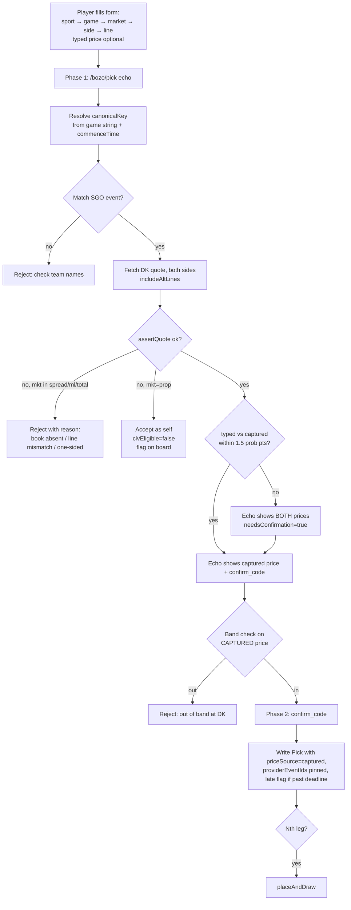
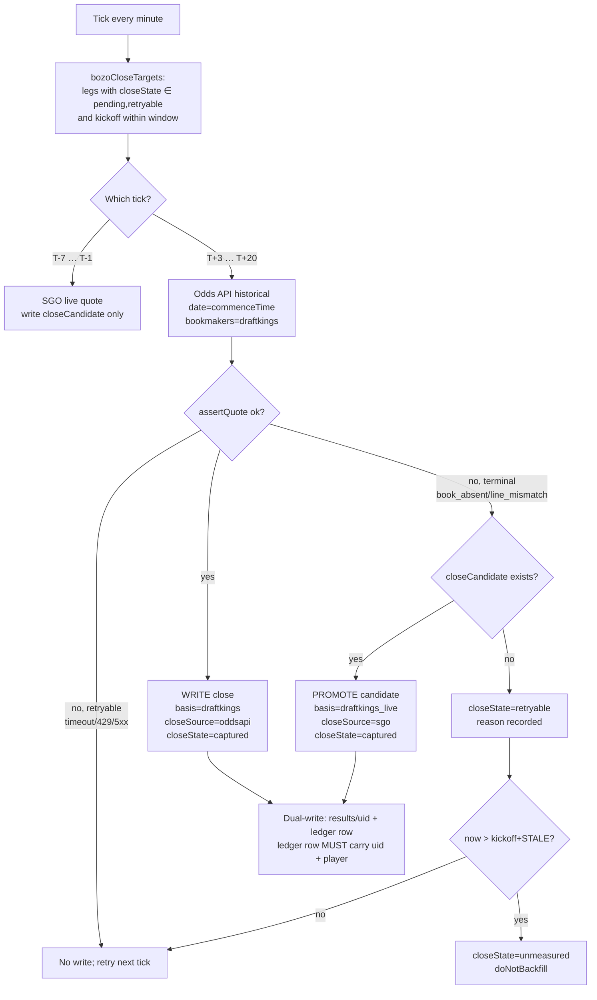
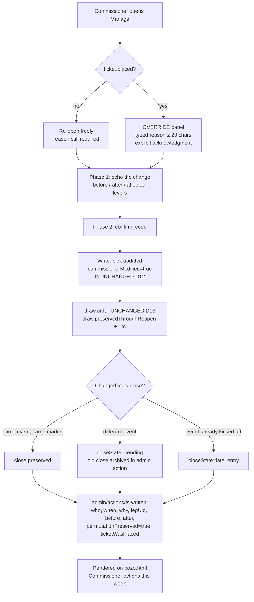
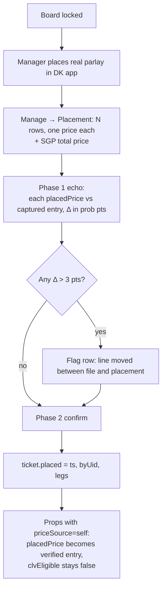
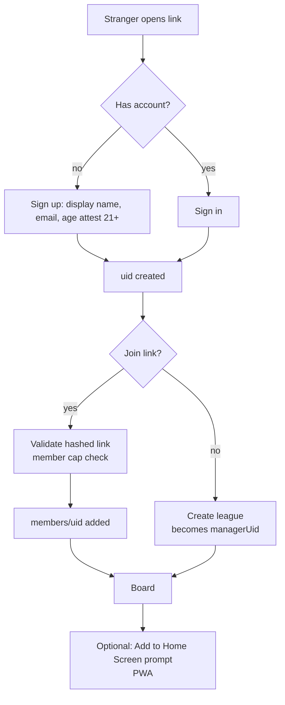
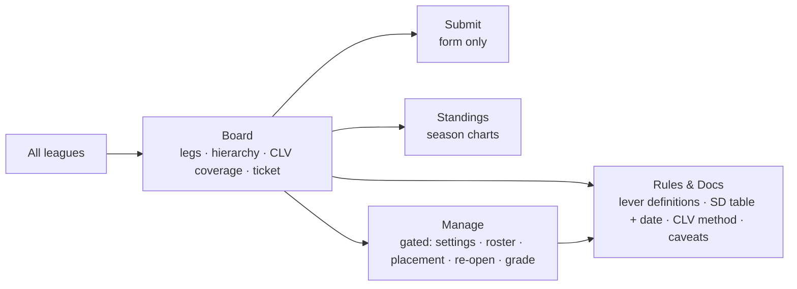

# Bozo — Workplan for Implementation

**Prepared for:** Codex, working on `github.com/JKapcar/data-dawgs`
**Owner:** Kap (commissioner / god admin)
**Date:** 2026-09-01 · Week 1 board open · roster in flux (see D18) · first kickoff **Sat 2026-09-05 12:00 ET — UNT @ IND**
**Status of this doc:** decisions locked; nothing below is open unless marked `OPEN`

> **This file supersedes `claude_bozo-fix-prompt.md`.** That document was written without reading the source and states two things that are now known to be wrong: that the close feed "is fine" and that no new odds provider should be added. Do not follow it. Its constraints that survive are reproduced in §0.2.

---

## 0. Read this first

Every prior plan for Bozo — the red-team audit, the fix-prompt from another session, and my own first pass — was written without reading the source. This one was written after reading `dawg-bot-worker.js` (15,995 lines), `bozo.html` (8,073 lines), `wrangler.jsonc`, the live Week 1 board, and the live CLV surface. Line numbers below refer to `main` as of 2026-09-01.

The most important consequence: **the plumbing is better built than any prior document credited, and the bugs are smaller than any prior document guessed.** Bug A is one regex. Bug B is a nullable field. Bug C is a missing `player` on one write path. The close pipeline already has immutability, alt lines, dual-write to ledger, and per-join failure reasons. Worst Beat already has an SD table and a synthetic-margin path for moneylines.

What is *not* built is the layer that makes it a product: submit-time price capture, a true archived close, a placement stage, commissioner tooling with an audit trail, a deadline, and a navigation structure a stranger could use. That is this plan.

### 0.1 Decisions locked in this session

| # | Decision | Choice | Why |
|---|---|---|---|
| D1 | Entry price source | **Captured by the engine at submit.** Typed price is a tripwire, never stored. | Self-report is the poison pill under every downstream number. |
| D2 | Close definition | **Per-leg, at that leg's kickoff.** Not at lock, not at Thursday. | CLV means the closing line. A deadline freeze compresses every CLV toward zero and duplicates Last In. |
| D3 | Deadline | **Thursday 13:00 ET, configurable. Late legs accepted and flagged on the board.** | Kap's call. |
| D4 | Worst Beat | **SD-normalized, all leg types.** Grader is the rule; simulator conforms. | Kap's call. A 7-pt NFL miss must not outrank a 3-goal NHL miss. |
| D5 | Providers | **The Odds API primary for close (archive at kickoff), SportsGameOdds secondary (live pre-kick), SGO for submit-time capture.** | Only self-serve provider with a timestamped archive. SGO free tier is 10-min delayed, so its "close" is systematically stale. |
| D6 | Budget | **Attempt $0 (both free tiers). $30/mo Odds API "20K" plan is headroom, not baseline.** | One league fits inside 500 free credits. ~50 leagues fit inside 20K. Beyond that the budget must scale with leagues, i.e. revenue. |
| D7 | Foreign IDs | **Never a join key.** ESPN, Odds API and SGO ids are attributes hung off a canonical key computed from `(league, sorted team pair, UTC date)` + kickoff tolerance. | This is the architecture behind Bug A and it is already half-true in the code. |
| D8 | Missing close | **Excluded. Never back-filled, never zero, never an assumed hold.** | Existing documented rule; preserved. A missing close scored as 0.00 invents a fake bozo. |
| D9 | Basis discipline | Only `draftkings` and `draftkings_live` enter the headline CLV mean. `consensus` is reported separately. `self`/`other` never enter. | A consensus close against a DK entry answers a question nobody asked. |
| D10 | Prop policy | Strict capture-or-reject for spread/ml/total. Attempt-then-flag for props (`priceSource: self`, `clvEligible: false`). `other` is always self, never CLV. | Props exist at DK but not always at the aggregator; blocking them is a regression. |
| D11 | Re-open after placement | Override with a typed reason, not a hard block. | Real life needs it; the audit log makes it safe. |
| D12 | Commissioner edit and Last In | Edited leg **keeps its original position**; leg is marked `commissionerModified`. | Last In is about who saw what. An admin fix must not reshuffle it. |
| D13 | Permutation | **Preserved across re-open.** A re-draw, if ever, logs old + new and renders on the page. | The single largest integrity hole in the feature. |
| D14 | Slip links | **Not parsed.** DK share links are login-walled and ToS-barred. Placement prices are entered manually by the manager. | Research settled it. |
| D15 | SGP | Ticket-level price only. **No per-leg CLV is derived from an SGP price.** Per-leg CLV uses each leg's straight-market DK price. | DK never exposes SGP leg prices; they cannot be untangled. |
| D16 | Scope | **Build as public, ship to the 8, then invite-only, then open.** Native app is out; PWA is the "app store." No money ever moves on-platform. | Apple rejects gambling-adjacent apps from individual developers. Keeping money off-platform keeps it out of licensing. |
| D17 | Player keys | **Migrate from `encodeURIComponent(displayName)` to auth `uid`.** Display name becomes an attribute. | Multi-tenant correctness; also the root of Bug C's cousin (`The%20Kid`). |
| D18 | Roster size | **Variable per league. `lockCount` derives from `members.length` unless the manager overrides it.** Eight is not a constant anywhere in code, copy, or math. | Bozo Boyz is nine. Every league will differ, and a hard-coded 8 becomes a migration the first time someone joins a tenth. |

**D18 consequences to check during implementation**

- Grep for the literal `8` in leg-count, lock, and placement contexts. Any survivor is a bug.
- Budget scales with N: `N × 10 credits × 4.3 weeks`. N=9 is ~390/mo, still inside the free 500, but a tenth member (~430) and an eleventh (~475) walk the cap. The credit meter (3.4) must warn on N, not on a fixed threshold.
- Parlay length is a product decision, not a side-effect of the roster. Nine legs is materially longer odds than eight; the Bozo gets named more often on a ticket that was never likely to cash. If a league wants a shorter ticket than its roster, `lockCount < members.length` must be legal, with the surplus members sitting out or rotating. Do not assume `lockCount === members.length`.
- Placement (3.6) and the slip form render N rows, read from the league, never a constant.

### 0.2 Constraints carried forward from the fix-prompt (unchanged)

- Keep the two-phase confirm on every write path. No silent writes.
- Human-facing pages are charts, graphs and actions only. Explanations and settings live on separate docs/settings pages.
- No scraper. No DraftKings endpoints, official or otherwise.
- Never substitute an entry price for a missing close. A leg with a `closeUnavailableReason` has no CLV and is excluded from any average.
- The commissioner may not edit another member's leg content without that leg being visibly marked commissioner-modified.

---

## 1. System map



**Facts that anchor the design**

- The worker is the **sole writer** to RTDB (`line 78: .write:false so no browser can write directly`). This retires the audit's CRITICAL-unverified rules finding. Auth lives in the worker, not in rules.
- Routes today: `/bozo/pick`, `/bozo/grade`, `/bozo/next`, `/bozo/buyback`, `/bozo/clv`, `/bozo/close`, `/bozo/close-gaps`, `/bozo/config`, `/bozo/leagues`.
- Close cron window: `BOZO_CLOSE_LEAD_MS = 7 min`, `BOZO_CLOSE_STALE_MS = 20 min` (6381–6384).
- The ledger comment (6160–6168) already reserves four write stages: `LOCK → KICKOFF → PLACEMENT → GRADE`. PLACEMENT is "slip parse (not built)". This plan builds it as manual entry.
- `boardLocked: !!out.placed` (13503). Locked and placed are one bit today.
- Picks are keyed `encodeURIComponent(name)` (4860, 13319). `The Kid` → `The%20Kid`.

---

## 2. Data model

### 2.1 Entities (RTDB, under `/leagues/{lid}`)

```
league
  id, name, managerUid, season, week, status, format, synthetic
  settings: { stake, band:{floor,ceiling}, allowEdit, lockRule, lockCount,
              levers:[..], deadline:{dow,hh,mm,tz}, clvClose:"kickoff",
              propPolicy:"attempt", lateLegPolicy:"flag" }
  members: { uid: { displayName, joinedTs } }
  picks:   { uid: Pick }
  results: { uid: Result }                     # this week's live board; cleared by /bozo/next
  ledger:  { "{season}-w{week}-{uid}": Row }   # permanent receipt, never cleared
  admin:   { actions: { ts: AdminAction } }    # NEW — commissioner audit trail
  draw:    { order:[..], drawnTs, drawnBy:"server", preservedThroughReopen:[ts..] }
  ticket:  { locked:{ts}, placed:{ts,byUid,legs:{uid:placedPrice}}, sgpPrice } # NEW split
```

### 2.2 Pick (submitted leg)

```
Pick {
  # identity
  uid, displayName, ts (server), late:boolean, commissionerModified:boolean|null
  # market
  sport, mkt: spread|ml|total|prop|other, side, line, label, game "AWAY @ HOME"
  # event identity (D7)
  canonicalKey, commenceTime, espnEventId?, providerEventIds:{sgo?, oddsapi?}
  # price (D1)
  price, priceOpp, priceSource: captured|self, entryBook:"draftkings",
  entryProvider, entrySnapshotAt, fairEntry, entryHold, clvEligible:boolean
  typedPrice?  # kept for audit; never used in math
}
```

### 2.3 Result (this week) and ledger Row (permanent)

```
Result / Row {
  # KICKOFF stage
  close, closeOpp, closeBook, closeSource: oddsapi|sgo|manual, closeObservedAt,
  closeState: pending|captured|retryable|unmatched|no_opp|void|late_entry|unmeasured,
  closeUnavailableReason, basis: draftkings|draftkings_live|consensus|none,
  closeCandidate: { price, priceOpp, source, observedAt }   # SGO pre-kick, promoted only if archive fails
  # PLACEMENT stage (NEW)
  placedPrice, placedTs
  # GRADE stage
  actual, result, won, margin, beatSd, beatBasis, bozo
  # provenance
  player (displayName at time of write), uid
}
```

### 2.4 State machines





Rule: **`captured` is immutable. Every other state is not.** This is the single change to the existing immutability at line 6584 — today a failure reason is as immutable as a price. Lands in Phase 2 (2.0), between weeks; Phase 1 does not touch it.

---

## 3. Process maps

### 3.1 Week lifecycle



### 3.2 Submit a leg — two-phase with capture



**Notes for Codex**
- Phase 1 must not write. Phase 2 stores the Phase-1 captured price and `entrySnapshotAt`, even if the line has moved in the 5-minute window. Do not re-fetch at Phase 2.
- `mkt=other` skips S2–S6 entirely; stored as `self`, `clvEligible=false`, `closeState=unmatched` at creation.
- The band check runs on the captured price, and the echo must show the captured price *before* the player sees a band rejection, or the rejection is unexplainable.

### 3.3 Close capture — the cron



**Notes for Codex**
- The existing bucketing by `(sport, hour)` at 6646–6652 stays. Add the archive call per event, not per bucket — the Odds API historical endpoint is per-event.
- Keep the existing rule at 6671: a fetch error writes *nothing* and retries.
- `closeCandidate` is the mechanism that lets SGO run *before* kickoff and the archive run *after*, without violating write-once on `close`.
- Credit budget: one historical call per leg per market = 10 credits. Do not call historical for `other` or for legs already `captured`.

### 3.4 Grade and lever walk

```mermaid
flowchart TD
  G0[/bozo/grade] --> G1[ESPN final scores per event]
  G1 --> G2[Per leg: actual, won]
  G2 --> G3{Margin market?}
  G3 -- "spread/total/prop with number" --> G4["margin = actual − line<br/>beatSd = margin / SD[sport,mkt]"]
  G3 -- ml --> G5["expected margin from REAL de-vig<br/>invNorm(fairEntry) × SD<br/>beatBasis=synthetic"]
  G3 -- "prop, no SD in table" --> G6[beatBasis=no-sd → skipped by walk]
  G4 --> G7[Losers only]
  G5 --> G7
  G6 --> G7
  G7 --> G8[Walk draw.order]
  G8 --> G9{Lever isolates one?}
  G9 -- yes --> G10[Bozo]
  G9 -- no --> G11[Next lever]
  G11 --> G9
  G9 -- "all levers exhausted" --> G12[Deterministic final tiebreak<br/>documented on rules page]
```

**Lever definitions (D4 confirmed)**

| Lever | Computation | Who is eligible |
|---|---|---|
| Shortest Odds | **highest** `fairEntry` (biggest favorite) among losers | losers |
| Worst Beat | most negative `beatSd`; `no-sd` legs skipped | losers with a margin |
| Worst CLV | most negative `clvPoints` among `basis ∈ {draftkings, draftkings_live}` | losers with a captured close |
| Last In | latest server `ts` | losers |

Change from today: line 6952 approximates de-vig for the ML synthetic margin with `rImp(price) − .022`. That is an assumed hold. Replace with `devigPair(price, priceOpp).fair` when `priceOpp` is present (it always will be after Phase 2); when absent, `beatBasis=no-sd`. Missing is better than wrong — same rule as CLV.

### 3.5 Commissioner re-open



Server-side auth: session → `uid`; require `league.managerUid === uid` on `/bozo/reopen`. No client flag. No hidden route.

### 3.6 Placement (slip entry)



Placed − entry is a separate number ("deadline drift"), charted, never mixed into CLV.

### 3.7 Onboarding and join



### 3.8 Navigation — target



Constraint: Board/Submit/Standings/Manage contain **no explanatory prose**. Every paragraph currently on bozo.html moves to Docs. Each chart gets one caption line and a `?` link.

---

## 4. Machine surface (MCP `dd_*` tools)

Additive changes only; existing callers keep working.

| Tool | Change |
|---|---|
| `dd_bozo_week` | Each leg gains `priceSource`, `clvEligible`, `late`, `commissionerModified`, `closeState`, `basis`. Add `deadline` and `ticket:{locked,placed}` at the top level. |
| `dd_bozo_clv` | Add `closeState`, `basis`, `closeSource`, `closeCandidate`. Keep the refusal to compute CLV server-side. Add `coverage:"n/N"` where N is the league's `lockCount`. |
| `dd_bozo_standings` | Key by `uid`; include `displayName`. Fix the `undefined` row. |
| `dd_draft_bozo_leg` | Returns the **captured** price and `priceOpp` in the echo, plus `agreement` if a typed price was supplied. |
| `dd_submit_bozo_leg` | Unchanged contract; Phase 2 stores captured values. |
| `dd_bozo_admin_actions` | **New, read-only.** Week's commissioner actions. |
| `dd_league_overview` | Add `deadline`, `ticket` state, `settings` summary. |

`stillWaitingOn` and every name-bearing field return display names, never encoded keys.

---

## 5. Workplan

Effort is solo-maintainer-with-Codex hours. Dependencies are hard.

### Phase 1 — Stop the bleeding · **deployed before Sat 2026-09-05 12:00 ET** · ~4h

| # | Task | File / line | Acceptance |
|---|---|---|---|
| 1.1 | `bozoMatchEvent`: ship in two layers. **Floor:** split on `@` and `vs`, with `UNT → North Texas` and `IU → Indiana` hard-coded. **Registry:** generate a dated seed from ESPN Core's football team indexes; normalize `abbreviation`, `displayName`, `shortDisplayName`, and `location` onto one canonical team key; cache the resulting aliases in KV; retain the floor aliases as fallback. The broader field set is required by observed data: ESPN `displayName` is `North Texas Mean Green`, while SGO `names.long` is `North Texas`. The 2026-09-05 SGO fixture also falsified the assumed universal `short / medium / long` shape: North Texas and Indiana contain `long` only, with `short` and `medium` absent rather than empty. `site.api.espn.com` currently returns 403 from Worker egress, so the reproducible seed generator uses the working `sports.core.api.espn.com` indexes and individual team records. Matching must never depend on optional SGO fields or a live ESPN request. | 6625–6639 | `"UNT @ IU"` matches SGO event `QzGmzxPGyovJ48j1BUHc`; `@` and `vs` both parse; the matcher and DK-side orientation succeed when SGO supplies only `names.long`; the 2026 seed covers 148 CFB and 32 NFL teams; registry aliases distinguish Miami / Miami (OH); hard-coded UNT/IU remains a fallback; a KV outage does not block matching |
| 1.2 | **Moved to Phase 2 as 2.0.** Phase 1 leaves the `close != null` / reason guard at 6584 untouched — no immutability change on live rows mid-week. | — | — |
| 1.3 | **Dropped.** Kap's leg is a preseason TEN @ SF game (`ts` Aug 14, kickoff mid-August). The cron already fired in its ±window three weeks ago, the `@` split failed, and the reason was written. Null-resetting it now does nothing — the window is gone. Leave it as the first honest `unmeasured`. Whether Kap re-files on a real Week 1 game is a league call, not a code change. | — | — |
| 1.4 | Bug C: close-capture ledger write must set `player` and `uid` on the row | 7112–7133 | `dd_bozo_standings` has no `"undefined"` key |
| 1.5 | Bug C': `stillWaitingOn` and any key-derived name goes through `decodeURIComponent` | 4860 and the MCP builder | `The Kid`, not `The%20Kid` |
| 1.6 | Regression tests: match + quote for ml / spread / total / prop, both separators, alt line, one-sided, book absent | `tests/` | All four market types pass; failure codes are distinct |

**Live test: Sat 2026-09-05, UNT @ IND, 12:00 ET.** Scope is close *capture* only — Tony's leg has `priceOpp: null`, so no CLV number comes out of Saturday and none should be expected. Success is: the leg matches, both sides quote, `close` is written. Any further legs filed before Thursday's deadline widen the test across Saturday and Sunday; the more college names on the board, the better the fixture.

Ship order: fixture → 1.1 → 1.4 → 1.5 → 1.6. 1.1 must be **deployed**, not merged, before Saturday noon ET. 1.4/1.5 are cosmetic for the lever walk and can slip past Saturday without cost. The cron already handles transient fetch errors by not writing (6671), so retry-after-terminal-failure (2.0) has near-zero marginal value this week once the matcher is fixed.

### Phase 2 — Submit-time capture · Week 2 · ~8h

| # | Task | Acceptance |
|---|---|---|
| 2.0 | **(from 1.2, not optional)** Introduce `closeState`; make only `captured` immutable. `bozoCloseTargets` selects `pending` and `retryable`. Run between weeks, never on a live board. | A leg with a `retryable` reason is re-attempted next tick until `STALE`; a `captured` close is never overwritten |
| 2.1 | `/bozo/pick` Phase 1: resolve canonicalKey, match SGO event, fetch DK quote both sides with alt lines, `assertQuote` | Echo contains captured `price`/`priceOpp`/`line` |
| 2.2 | Tiered policy per D10 | spread/ml/total reject on failure; prop falls to `self` with `clvEligible=false`; `other` always self |
| 2.3 | Typed price → `agreement` check (1.5 pts), `needsConfirmation` in echo | A 15-pt gap shows both prices; nothing is silently accepted |
| 2.4 | Band check on captured price, with echo ordering per 3.2 | No band rejection without the captured price shown first |
| 2.5 | Store `providerEventIds.sgo`, `entrySnapshotAt`, `fairEntry`, `entryHold`; kill `priceOpp: null` at the validator | Validator rejects a game-market leg with null `priceOpp` |
| 2.6 | Board renders `priceSource` badge and `clvEligible` | A self-priced prop is visibly different from a captured leg |
| 2.7 | **(from 3.2)** SGO pre-kick tick at T−7…T−1 writes `closeCandidate` only. **Additive**: the existing SGO close write at kickoff stays as-is until 3.2 replaces it. Do not make SGO candidate-only in this phase or Weeks 2–3 lose their closes. | Every game-market leg has a `closeCandidate` before kickoff; `close` still written by the existing path |
| 2.8 | Adapter interface: SGO adapter exposes a common `getMarket(event, spec, {at})` shape | Phase 3's Odds API adapter implements the same signature without changing callers |

### Phase 3 — Archive close + second provider · Week 3 · ~8h · $0 → $30

| # | Task | Acceptance |
|---|---|---|
| 3.1 | Odds API adapter: `listEvents`, `getMarket(at=commenceTime)` for `spreads/h2h/totals` + prop keys, `bookmakers=draftkings`, `oddsFormat=american` | Historical call returns `timestamp ≤ commenceTime` and both outcomes |
| 3.2 | Odds API archive at T+3…T+20 writes `close`; promotion rule from `closeCandidate` (written since 2.7) on terminal archive failure; SGO's direct close write is retired here, not before | `basis` is `draftkings` when archive succeeds, `draftkings_live` when promoted; no leg loses a close in the switchover |
| 3.3 | Alt-line retry: on `line_mismatch` for spread/total, retry `alternate_spreads`/`alternate_totals` | A bought-down number captures |
| 3.4 | Credit meter in KV: count per league per month; warn at 400 (free) / 16K (paid) | Manage page shows credits used |
| 3.5 | Gate: after two Sundays, if Phase-1 SGO capture ≥ 87% of eligible legs and stale-close tolerable, Phase 3 stays on free tier; else enable $30 | Decision recorded in `docs/` |

### Phase 4 — Worst Beat unification · Week 3 · ~6h

| # | Task | Acceptance |
|---|---|---|
| 4.1 | Simulator conforms to grader: SD-normalized (D4). Remove the raw-margin path flagged at 4370 | One definition in code and in `data/bozo-rules.json` |
| 4.2 | Replace `rImp(price) − .022` with real de-vig from `priceOpp`; `no-sd` when absent | No assumed hold anywhere in the codebase |
| 4.3 | SD calibration script: empirical SD of `(actual margin − closing spread)` and `(actual total − closing total)` per sport from prior-season ESPN data → `data/bozo-sd.json` with `asOf` | Table date renders on Docs |
| 4.4 | Prop SD table for the top 15 stat types (NFL pass/rush/rec yds, receptions, TDs; NBA pts/reb/ast/3s; MLB Ks/TB/hits; NHL SOG/pts) | Props participate in Worst Beat; others `no-sd` |

### Phase 5 — Deadline + Placement · Week 4 · ~8h

| # | Task | Acceptance |
|---|---|---|
| 5.1 | `settings.deadline` (dow/hh/mm/tz, default Thu 13:00 ET); server stamps `late=true` past it | Late leg shows a badge; nothing else changes (D3) |
| 5.2 | `ticket` node split: `locked` vs `placed` (D11 prerequisite) | `boardLocked` no longer derived from `placed` |
| 5.3 | Placement form per 3.6; two-phase; `placedPrice` per leg; SGP total | Δ > 3 pts flagged |
| 5.4 | Chart: entry → placed → close per leg | Deadline drift visible, separate from CLV |

### Phase 6 — Commissioner re-open + audit · Week 5 · ~12h

| # | Task | Acceptance |
|---|---|---|
| 6.1 | `/bozo/reopen`: manager-only, two-phase, reason required, override mode when `ticket.placed` | Unauthorized → 403; missing reason → 400 |
| 6.2 | D12/D13 semantics: `ts` unchanged, `commissionerModified`, permutation preserved and logged | Test: re-open does not call `placeAndDraw` |
| 6.3 | Close handling per 3.5 | Test each of the three branches |
| 6.4 | `admin/actions` written and rendered on Board | Every re-open is visible the same week |
| 6.5 | Delete the "cron (not built)" comment at 6165 and update the four-stage comment | Comments match reality |

### Phase 7 — Navigation split · Week 6 · ~16h

Board / Submit / Standings / Manage (gated) / Docs per 3.8. All prose to Docs. Charts on real data; demo data behind an explicit "sample" toggle with the ⚠️ retained.

### Phase 8 — Multi-tenant hardening + onboarding · Weeks 7–8 · ~24h

| # | Task |
|---|---|
| 8.1 | Migrate pick/result/ledger keys to `uid` (D17); one-time migration script; dual-read during transition |
| 8.2 | `managerUid` per league; all manager routes check it server-side |
| 8.3 | Sign-up with age attestation; email verification; session expiry |
| 8.4 | Rate limits per uid on write routes; join-link hash verified in code |
| 8.5 | XSS pass: every user string via `textContent` |
| 8.6 | Terms + privacy page: no money on-platform, off-platform settlement, data retention |

### Phase 9 — PWA + notifications + bot · Weeks 9–10 · ~20h

Manifest, service worker, guided iOS "Add to Home Screen," Web Push on lock / bozo named. Discord `/bozo submit` that calls the same Phase-1/Phase-2 path (captures server-side by construction).

### Phase 10 — Public readiness · Week 11+

Invite-only cohort of 5 leagues → credit meter data → budget decision (D6) → open sign-up. Not before Phase 8 is complete.

---

## 6. Test plan

| Area | Tests |
|---|---|
| Match | `@`/`vs` separators; SGO short/medium/long names; alias collisions; tolerance ±3h; doubleheader picks nearest |
| Quote | one-sided rejected; line mismatch rejected; wrong book rejected; alt-line retry succeeds; insane price rejected |
| Close cron | candidate written pre-kick; archive wins post-kick; promotion only on terminal archive failure; retryable never writes a reason; STALE → unmeasured; `captured` never overwritten |
| CLV math | −245/+200 → 68.06%; missing any side → not measurable; sign correct; consensus excluded from headline mean |
| Worst Beat | SD table applied; ML synthetic uses real de-vig; `no-sd` skipped; simulator == grader on fixtures |
| Deadline | late flag exactly at boundary in league tz; DST week |
| Placement | Δ flag; `ticket.placed` set; props promoted to verified entry but not `clvEligible` |
| Re-open | non-manager 403; no reason 400; `ts` unchanged; `draw.order` unchanged; three close branches; action rendered |
| Keys | `uid` everywhere; decode never leaks; standings has no `undefined` |
| Roster size (D18) | Board locks at `lockCount`, not 8; N=2, 8, 9, 12 all lock correctly; placement form renders N rows; `coverage` reads `n/N`; a member joining mid-week does not retroactively change an already-locked board; `lockCount < members.length` is legal |
| Machine surface | every `dd_*` tool returns the new fields; two-phase intact |

---

## 7. Budget model (D6)

The Odds API credits: events list = 0; live event odds = 1 per region per market; historical event odds = 10 per region per market. One region (`us`), one market per leg.

| Load | Entry (SGO, free) | Close (Odds API) | Credits / month |
|---|---|---|---|
| 1 league, N legs, ~4.3 weeks | 0 | N × 10 × 4.3 | N=8 → ~345 · **N=9 → ~390** · both fit free 500 |
| 5 leagues | 0 | | ~1,700 → needs $30 (20K) |
| 50 leagues | 0 | | ~17,000 → ceiling of $30 |
| 51+ leagues | | | budget must scale with leagues → revenue |

SGO free tier: 2,500 objects/mo, 10 req/min. One league uses ~40 objects/mo for submit capture + ~40 for pre-kick candidates. Fine to ~25 leagues.

Cloudflare free: 5 cron triggers/account, 50 subrequests/invocation, no cron retry. The archive makes a missed tick recoverable, so no paid plan is needed under the cap.

---

## 8. Risks

| Risk | Likelihood | Mitigation |
|---|---|---|
| Adapter wire formats differ from documented shapes | High | Phase 1.6 fixtures from real responses; Codex must capture one live response per provider before writing parsers |
| SGO free-tier 10-min delay makes `draftkings_live` closes noticeably stale | Certain | Basis tag + Phase 3 archive; Docs page states it |
| Prop coverage gaps at both aggregators | Medium | D10 tiered policy; placement price as verified entry |
| Apple rejects any native wrapper | Certain for gambling-adjacent from an individual | PWA only (D16) |
| Budget cap vs public scope | Certain past ~50 leagues | Credit meter; revenue decision at Phase 10 |
| SD table uncalibrated → Worst Beat wrong in a decisive week | Medium | Phase 4.3 before any public cohort |
| Migration to `uid` keys breaks in-flight week | Medium | Run between weeks; dual-read; ledger untouched |
| Commissioner re-open used casually | Low | Reason required; rendered same week; `preservedThroughReopen` visible |
| **Out-of-season / preseason game accepted onto a regular-season board** | **Confirmed — happened Week 1 (Kap, preseason TEN @ SF)** | Parking lot: submit-time validation that `commenceTime` falls inside the league's current week window and the event is a regular-season game. Not a Phase 1 fix; the leg is already `unmeasured`. Fold into Phase 2 validation (2.1–2.5) where canonicalKey resolution already reads `commenceTime`. |

---

## 9. Handoff checklist for Codex

- [ ] Capture one raw JSON response from SGO `/v2/events` (with `includeOpposingOdds`, `includeAltLines`) and one from Odds API `/historical/.../events/{id}/odds` **before** writing parsers. Commit under `tests/fixtures/`.
- [ ] Phase 1 shipped and Sunday capture rate recorded in `docs/bozo-capture-log.md`.
- [ ] Every new field added to the MCP tools' schemas in the same PR as the write path.
- [ ] No route writes without a Phase-1 echo and a Phase-2 `confirm_code`.
- [ ] No assumed hold anywhere. Grep for `.022` returns nothing.
- [ ] Docs page carries: lever definitions, SD table with `asOf`, CLV method with the de-vig formula, basis definitions, close-state definitions, budget/provider caveats.
- [ ] `data/bozo-rules.json` and the simulator agree with the grader on fixtures.

---

## 10. Session handoff protocol

One chat per phase. Open each with:

> Phase N of the workplan (project files). Read it, pull the current `dawg-bot-worker.js` from `main`, and start with the checklist item that captures a raw provider response into `tests/fixtures/`.

**Phase 1 opener, verbatim:**

> Phase 1 of the workplan (project files). Pull the current `dawg-bot-worker.js` from `main`. Before writing any matcher code, capture one raw SGO `/v2/events` response (with `includeOpposingOdds`, `includeAltLines`) for **UNT @ IND, Sat 2026-09-05 16:00Z**, and commit it to `tests/fixtures/`. Note the exact `names.short/medium/long` SGO returns for Indiana and North Texas. Then do 1.1, with the alias table seeded from those names. 1.1 must be **deployed** before Saturday noon ET. Skip 1.3 — Kap's game was preseason and is past its window; leave it `unmeasured`.

The fixture-capture instruction matters most for Phases 1–3 and is the step a fresh session will skip unless told.

Phase 3 opens with one extra line: **"Read `tests/fixtures/sgo-*.json` and the `getMarket(event, spec, {at})` signature from 2.8 before touching the adapter interface."** Phase 3 implements a second provider behind an existing interface; it does not redesign it. Phases 2 and 3 stay separate chats because gate 3.5 decides on The Odds API using two Sundays of Phase 1/2 data — merging them builds the second adapter before the data that justifies it exists.

`odds-engine/` from the prior session is **reference only** — four ideas to port (the matcher, retryable-vs-terminal states, submit-time capture, basis tagging), not a module to drop in. It was written without reading `dawg-bot-worker.js`.
